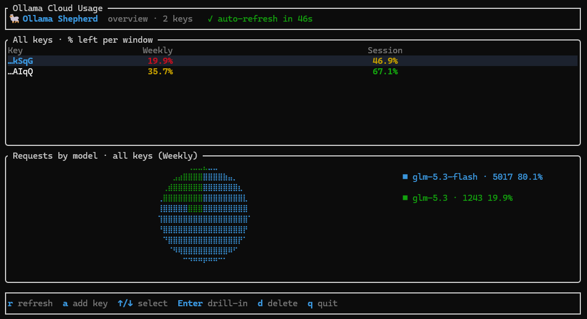

# 🐑 Ollama Shepherd

A terminal dashboard for monitoring **Ollama Cloud** subscription usage across
**multiple API keys** — percentage remaining per usage window (session / weekly /
monthly), plus braille pie charts of your model request distribution.



 

## Features

- **Multi-key overview** — one table, one row per API key, one column per usage window
  (`Session`, `Weekly`, `Monthly` — columns adapt to what the API returns)
- **Drill-in view** (`Enter`) — stacked gauges for every window of the selected key
- **Pie charts** — request distribution per model, per key and aggregated across all keys,
  rendered in braille high-resolution via [`tui-piechart`](https://github.com/sorinirimies/tui-piechart)
- **Self-updater** — built-in `update` command pulls the latest GitHub release
- **Local & private** — keys are stored only in `~/.ollama-shepherd/keys.json` and sent
  only to `https://ollama.com/api/usage`

## Install

### One-liner

**Linux (x86_64):**

```bash
curl -fsSL https://raw.githubusercontent.com/gianni-bischoff/OllamaShepherd/master/install.sh | bash
```

Installs to `~/.local/bin` (override with `INSTALL_DIR=/usr/local/bin`). Requires `curl`, `tar`, `sha256sum`.

**Windows (x86_64, PowerShell):**

```powershell
irm https://raw.githubusercontent.com/gianni-bischoff/OllamaShepherd/master/install.ps1 | iex
```

Installs to `%LOCALAPPDATA%\Programs\ollama-shepherd` and adds it to your user PATH
(override with `$env:SHEPHERD_DEST = "D:\Bin"` before piping).

Both scripts download the latest release, **verify the SHA256 checksum**, install the binary and tell you how to run it. To pin a version: `VERSION=v0.2.2` (Linux) / `$env:SHEPHERD_VERSION="v0.2.2"` (Windows).

### Manual

Grab the archive for your platform from the
[latest release](https://github.com/gianni-bischoff/OllamaShepherd/releases/latest),
extract it and put the binary somewhere in your `PATH` (e.g. `D:\Bin`).

### Build from source

```bash
git clone https://github.com/gianni-bischoff/OllamaShepherd
cd OllamaShepherd
cargo build --release
# binary lands in CARGO_TARGET_DIR or ./target/release
```

## Usage

```bash
ollama-shepherd            # launch the TUI
ollama-shepherd update     # self-update to the latest GitHub release
ollama-shepherd update --check   # only check, don't install
ollama-shepherd --version
```

### TUI keys

| Key | Action |
|---|---|
| `a` | add key (`label,ok-…` or just `ok-…`) |
| `↑/↓` | select key |
| `Enter` / `→` | drill into selected key |
| `Esc` / `←` | back / quit |
| `r` | refresh |
| `d` | delete selected key |
| `q` | quit |

Auto-refreshes every 60 s.

## Getting API keys

1. Sign in at [ollama.com](https://ollama.com)
2. Go to **Settings → API Keys** → create a key (starts with `ok-`)
3. One key per subscription/account you want to watch

## How it works

Talks to the official `GET https://ollama.com/api/usage` endpoint (Bearer auth).
Windows are reported as a `0..1` usage fraction; the app shows **% left**.
The API does not expose reset timestamps — resets follow your plan's billing cycle.

## License

MIT